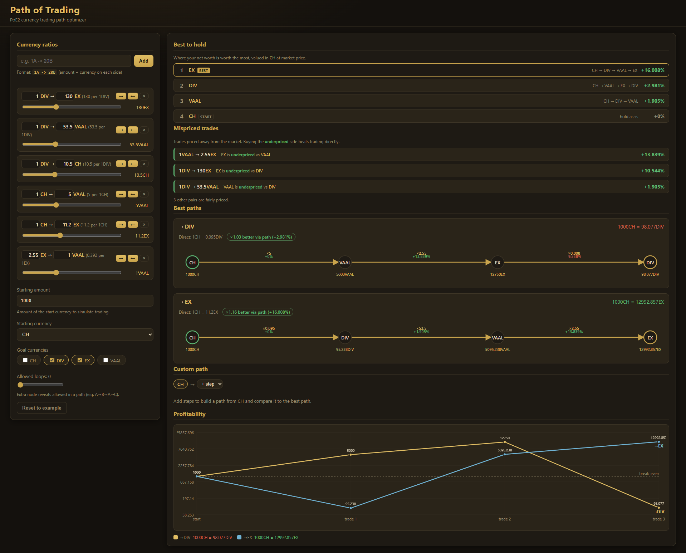

# Path of Trading

A **Path of Exile 2 currency trading path optimizer**. Enter the exchange ratios you
see on the market, and it finds the most profitable way to convert one currency into
another — including multi-step routes that beat trading directly.

It's a single static page with no build step, no dependencies, and no server. Open
`index.html` in a browser and everything runs locally. Your data is saved to
`localStorage`, so it persists between sessions.

## Features

- **Ratio editor** — add trades in plain text (`1A -> 20B`, the `→` arrow and spaces
  are also accepted). Tune each rate with a slider or type an exact amount.
- **Per-direction control** — every ratio is bidirectional by default. Toggle the
  `→` / `←` buttons to disable a direction for one-way or low-volume exchanges.
- **Best paths** — for each goal currency, the optimizer finds the highest-yield
  route from your start currency and shows a step-by-step diagram with the per-step
  value profit, plus a comparison against trading directly.
- **Best to hold** — ranks every currency by how much net worth you retain when
  holding wealth in it, valued at market price in your start currency.
- **Mispriced trades** — highlights arbitrage edges where a currency is underpriced
  relative to the market, with the value gained by trading the favorable direction.
- **Custom path** — build a route step by step and compare its yield against the
  optimizer's best path to the same currency.
- **Profitability chart** — plots how much you hold after each trade, one line per
  goal, with a break-even reference line.
- **Starting amount** — simulate trading a specific quantity; all results and charts
  scale to it.
- **Loop budget** — allow a number of node revisits so cyclic routes (e.g.
  `A → B → A → C`) can be considered.
- **Connectivity warning** — flags currencies that have no ratio connecting them to
  the rest of the graph.

## Usage

1. Open `index.html` in any modern browser.
2. Add the exchange ratios you want to consider in the **Currency ratios** panel.
3. Pick your **Starting currency**, the **Goal currencies** to optimize toward, and
   optionally a **Starting amount** to simulate.
4. Read off the best routes, the best currency to hold, and any mispriced trades.

Click **Reset to example** at any time to restore the bundled PoE2 sample ratios.

## How it works

Each ratio defines a directed conversion rate. The optimizer runs a max-product
depth-first walk from the start currency, respecting the loop budget, and records the
highest-yield path to every reachable currency. To measure *real* profit rather than
the raw rate, every currency is priced in start-currency terms using the direct market
rate as the fair reference — so a fair-rate trade reads `+0%` and only a cross-rate
that beats the market shows a gain.

## Project structure

| File | Purpose |
| --- | --- |
| `index.html` | Page structure |
| `styles.css` | Styling (PoE-themed dark palette) |
| `app.js` | All logic: parsing, state, pathfinding, and rendering |
